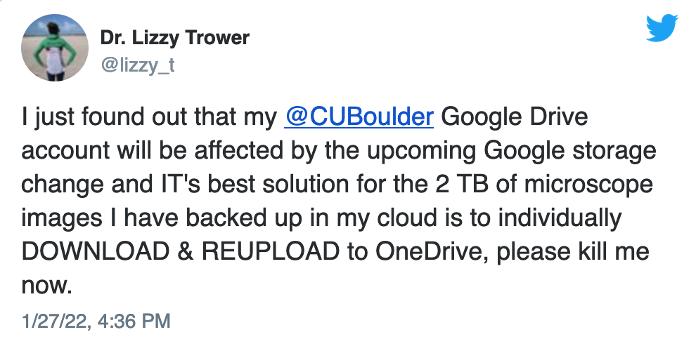

# ODS-Starter

A repository detailing the documentation for the OneDataShare System

This document will discuss the various deployment patters that users can take to moving their data. It will also cover
the protocols we support as well as the limitations & enhancements we apply per protocols.

## Disclosure

If you have any feature requests, questions, or concerns please feel free to open an issue in this repository, and we
will answer promptly. Cheers

## Relevant Repositories

1. [ODS CLI](https://github.com/didclab/ods-cli) (Release)
2. [Pmeter](https://github.com/didclab/pmeter) (Release)
3. [ODS Transfer Service](https://github.com/didclab/Transfer-Service) (Release)
4. [ODS Transfer Scheduler](https://github.com/didclab/transfer-scheduler) (Release)
5. [ODS MetaData](https://github.com/didclab/ods-metadata) (In Development)
6. [Endpoint Credential](https://github.com/didclab/endpoint-cred-service) (Release and Private)
7. [C++ SDK](https://github.com/didclab/CClient) (Beta)
8. [OneDataShare Monolith](https://github.com/didclab/onedatashare)
9. [ODS Scheduler](https://github.com/didclab/transfer-scheduler)

## Important Protocol Limitations

- [S3](https://www.researchgate.net/publication/335608365_Amazon_S3) (Release)
- [FTP](https://www.rfc-editor.org/info/rfc959) (Release)
- [SFTP](https://datatracker.ietf.org/doc/html/rfc913) (Release)
- [HTTP](https://datatracker.ietf.org/doc/html/rfc2616) (Release)
- VFS stands for virtual file system and is only available to users who use the Hybrid or On-Premise deployment
  model(Release)
- [Box](https://www.box.com/) (Release)
- [Dropbox](https://www.dropbox.com/) (Release)
- [SCP](https://en.wikipedia.org/wiki/Secure_copy_protocol) (Release, SCP is deprecated as of April 2019 and uses SFTP by default)
- [Google Drive](https://www.google.com/drive/) (Beta)

## Use Case

Let's discuss the use case of OneDataShare and why you as a user would consider ODS compared to using 
[RClone](https://github.com/rclone/rclone), [Globus](https://www.globus.org/), [Airavata](https://arxiv.org/pdf/2107.03882.pdf), [Go Anywhere](https://www.goanywhere.com/solutions/cloud-file-transfer) tool. 
Consider the following image 
Let's consider how I might handle moving ~2TB worth of data on my personal network. 
Right now I have a 400Mbps network that I pay for provided by Spectrum. So we convert from bytes to bits which gives us 16Tb which means in the best conditions this would take
~3.7 days assuming that I have a 400Mbps link dedicated to me to the fullest capacity, which we all know to not be true.
In summary Spectrum or any other ISP would never actually provide the full dedicated link to you as maybe they change the way they route data due to some cost savings.

To saturate one's link is an open problem currently and users are not in the business of doing this themselves, they are focused on their own unique problems.
If ODS did not exist I would most likely use RClone to transfer my data from Google Drive to OneDrive.
The big issue is that RClone is static when it comes to observing your network it does an initial check and then uses those parameters for the rest of the transfer offering no dynamic tuning depending on the conditions of your network.
Networks are highly volatile, and they are most importantly fair. This means that the maximum throughput you can hope to experience is constantly changing, and there is a long list of factors affecting your experience on the network.
OneDataShare has the sole goal of moving your data as fast as possible, while maintaining security standards and not storing any of your data in our system.
If you would like to read more about the research behind ODS I have provided links below to relevant research papers.

## Saas Users

[OneDataShare](https://onedatashare.org) for Saas users is very simple. A user can create a free account and add any of
the supported protocols using the frontend. This will allow users to navigate and manage their filesystems through the
OneDataShare UI. This approach is very supportive of users who do not wish to install anything on their system or are
simply unable too. This is the simplest approach to using OneDataShare as there is nothing, but a UI. When the user has added at
least 2 endpoints then the user may begin sending file transfers between the two endpoints. We currently do not support
the scattering and gathering of files. If this is a feature you require please submit an issue with a clear description
of how and why you would like this operation. In the bottom of the Transfer-Page the user is able to select some
initial parameters to begin the transfer with. Now each protocol has limitation which will be covered below as these are
hard restrictions.

## Transfer Options

This section will explain the verbiage of the transfer options, and some recommended default values.

- Parallelism: the number of parallel threads to transfer a single file. The range I would advise if supported is 1-64.
  I do not believe that anything above 64 would do anything but add a massive amount of context switching.
- Concurrency: the number of files to transfer simultaneously and in parallel. This is limited to the number of
  connections the receiving server is able to open for a single user.
- Chunk Size: The buffer size that each thread should read and then write for every file in the transfer. This value is
  fixed throughout the entire transfer, and I would advise to be aggressive with this value. The higher the value the
  more abusive this will be on RAM as such decreasing the number of IO operations performed.
- Pipe Size: This represents pipelining, and it is the number of successive read() operations to a single write()
  operation. If you come from a batch systems world then this would be called commit interval as well. The longer the
  distance between the source and destination the higher this value should be.
- Retry: A fixed number of times to retry a chunk per file. So if this is set to 5, and a file has had 5 failures in
  sending any chunk of the file. Then after 5 retries we will fail that step.
- Overwrite: if the destination has the file with the same name/id in the same path then we will over write that file.
- Encrypt: This value is currently meaning less, but if set to true we will then use SSL -> FTP, SFTP, HTTPS.
- Compress: Currently this only supported for SFTP as the protocol supports this. ODS decides the compression level.
- Optimization: We are currently developing the Optimization side of the project, right now we plan to add two kinds:
  RL, and Bayesian Optimization.

Currently, ODS uses [t2.micro](https://aws.amazon.com/ec2/instance-types/)
and [C4](https://aws.amazon.com/ec2/instance-types/) instances to do your data transfer. As we do not have any payment
system, if you require larger instances please submit and instance, and we will work with you for the desired result.

## Protocol Limitations Table

This table represents what ODS currently supports, we are working on supporting everything below. 

| Protocol | Parallelism | Concurrency | Pipelining | Chunk Size | Optimizer | Retry | Compress | Integrity | Overwrite | Read | Write |
| -------- | ----------- | ----------- | ---------- | ---------- | --------- | ----- | -------- | --------- | --------- | ---- | ----- |
| S3 | &check; | &check; | &check; | > 5MB | &check; |&check; |&check; |&cross; | &check; |&check; | &check; |
| FTP | &cross; | check max supported connections per user | &check; | &check; | &check; |&check; |&cross; |&cross; | &check; | &check; | &check; |
| SFTP | &cross; | check max supported connections per user | &check; | > 5MB | &check; |&check; |&check; |&cross; | &check; | &check; | &check; |
| HTTP | &check; | &check; | &check; | &check; | &check; |&check; |&cross; |&cross; | &cross; | &check; | &cross; |
| Box | &check; | &check; | &check; | 20MB | &check; |&check; |&check; |&check; | &check; | &check; | &check; |
| Dropbox | &check; | &check; | &check; | &check; | &check; |&check; |&cross; |&check; | &check; | &check; | &check; |
| Google Drive | &cross; | &check; | &check; | &check; | &check; |&check; |&cross; |&cross; | &check; | &check; | &cross; |

## Hybrid Users

I would like to state if you are a "power user" or someone in the HPC world that is attempting to move massive data over a WAN or really any kind of network
then I would advise you use this deployment if your HPC site gives you access to install and deploy your own
software. Many HPC sites such as [CCR](https://ubccr.freshdesk.com/support/solutions/articles/13000014882-data-transfer-options) offer a DTN(Data Transfer Node) that has a very high capacity link to the public internet. 
The DTN is where I would recommend deploying the [Transfer-Service](https://github.com/didclab/Transfer-Service) and I would
recommend you deploy this on your site using Singularity because Docker has a software defined networking which would provide
an overhead to the network I/O. We expose a Dockerfile that you can convert into a Singularity build. I am currently
writing a singularity configuration file, so we will soon offer a direct singularity build for all customers to use. 
If your site does not offer any container runtime then you will need to manually install, to do this please reference the [README.txt](https://github.com/didclab/Transfer-Service).

## On-Premise

Deploying our entire ODS platform onto your site is not something I would advise but if you have a valid use case please
open a ticket, and we will be in contact promptly.

## ODS Stack

## ODS Research Links

